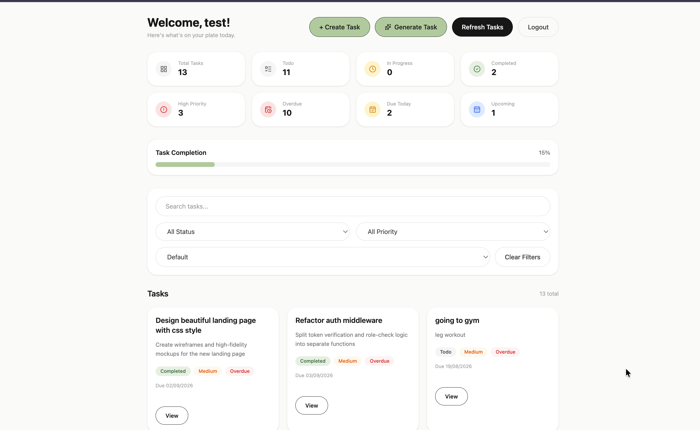

# Taskzee

> **AI-Powered Task Management Application built with the MERN Stack**

Taskzee is a full-stack task management application designed to help users organize, prioritize, and track their work efficiently. It combines a structured task management system with an AI-powered task generation feature that converts natural-language goals into actionable tasks.

---

## 🚀 Features

### 🔐 Authentication

* User registration and login
* JWT-based authentication
* HTTP-only cookies for authentication
* Protected routes
* User-specific task ownership
* Secure server-side authorization

### ✅ Task Management

* Create tasks
* View tasks
* View individual task details
* Edit tasks
* Delete tasks
* Task status management
* Task priority management
* Due-date management

### 🔎 Task Organization

* Search tasks by title
* Filter by status
* Filter by priority
* Sort tasks
* Pagination
* Clear filters

### 📊 Productivity Dashboard

Taskzee provides an overview of task progress through:

* Total tasks
* Todo tasks
* In-progress tasks
* Completed tasks
* High-priority tasks
* Overdue tasks
* Tasks due today
* Upcoming tasks
* Overall completion percentage
* Visual completion progress

### 🤖 AI Task Assistant

Taskzee integrates Google's Gemini API to generate tasks from a user's natural-language goal.

For example:

> **Goal:** Prepare for a technical interview

The AI generates a structured task containing:

* Task title
* Description
* Priority
* Status
* Due date

The generated task is validated before being stored in MongoDB.

---

## 🧠 AI Task Generation Architecture

The AI feature follows a dedicated backend flow:

```text
User Goal
    ↓
React Frontend
    ↓
AI API Endpoint
    ↓
AI Controller
    ↓
AI Service
    ↓
Google Gemini
    ↓
Structured JSON
    ↓
Zod Validation
    ↓
Task Model
    ↓
MongoDB
```

### Why this architecture?

The AI service is responsible for generating structured task data, while the controller handles application-level responsibilities such as authentication and task ownership.

The AI service does **not** directly interact with MongoDB.

The generated response is validated using Zod before being passed to the database layer.

The authenticated user's ID is assigned as the task owner on the server rather than being accepted from the client.

---

## 🏗️ System Architecture

```text
                    React Frontend
                         │
                         ↓
                  Axios API Layer
                         │
                         ↓
                  Express.js API
                         │
              ┌──────────┴──────────┐
              ↓                     ↓
         Controllers           Middleware
              │
              ↓
           Services
              │
              ↓
        Mongoose Models
              │
              ↓
           MongoDB
```

AI generation extends the architecture:

```text
React
  ↓
AI Route
  ↓
AI Controller
  ↓
AI Service
  ↓
Gemini API
  ↓
Zod Validation
  ↓
Task Model
  ↓
MongoDB
```

---

## 🛠️ Tech Stack

### Frontend

* React
* React Router
* Axios
* Context API
* Custom Hooks
* Tailwind CSS

### Backend

* Node.js
* Express.js
* MongoDB
* Mongoose
* JWT
* HTTP-only Cookies

### AI

* Google Gemini API
* `@google/genai`
* Zod

---

## 🔒 Authentication & Security

Taskzee implements authentication and authorization at the backend level.

### Authentication

* JWT-based authentication
* HTTP-only authentication cookies
* Authentication middleware
* Protected API routes

### Authorization

Each task belongs to an authenticated user.

The backend obtains the user identity from the authenticated request:

```text
Authenticated User
        ↓
req.user.id
        ↓
Task.owner
```

The application does not rely on a client-provided `owner` value to determine task ownership.

This prevents users from attempting to assign resources to another user's account through request data.

---

## 🌐 REST API

### Authentication

| Method | Endpoint             | Description         |
| ------ | -------------------- | ------------------- |
| POST   | `/api/auth/register` | Register a new user |
| POST   | `/api/auth/login`    | Login user          |
| POST   | `/api/auth/logout`   | Logout user         |

### Tasks

| Method | Endpoint         | Description         |
| ------ | ---------------- | ------------------- |
| POST   | `/api/tasks`     | Create a task       |
| GET    | `/api/tasks`     | Get user's tasks    |
| GET    | `/api/tasks/:id` | Get a specific task |
| PATCH  | `/api/tasks/:id` | Update a task       |
| DELETE | `/api/tasks/:id` | Delete a task       |

### AI

| Method | Endpoint                 | Description              |
| ------ | ------------------------ | ------------------------ |
| POST   | `/api/ai/generate-tasks` | Generate a task using AI |

---

## 📁 Project Structure

### Frontend

```text
src/
├── features/
│   ├── auth/
│   │   ├── api/
│   │   ├── components/
│   │   ├── context/
│   │   ├── hooks/
│   │   └── pages/
│   │
│   └── task/
│       ├── api/
│       ├── components/
│       ├── context/
│       ├── hooks/
│       └── pages/
│
└── shared/
    ├── api/
    └── components/
```

The frontend follows a feature-based architecture to keep authentication, task management, and shared functionality separated.

---

## 🔄 Frontend Data Flow

Task-related operations follow:

```text
UI Component
     ↓
Custom Hook
     ↓
Context
     ↓
API Function
     ↓
Axios
     ↓
Backend API
```

This separation keeps UI components focused on presentation while API communication and application state remain independently organized.

---

## 🧪 Validation

Taskzee uses validation at multiple layers.

### Zod

Zod validates structured AI output before it reaches the database layer.

### Mongoose

Mongoose provides database-level schema validation and business rules.

This provides an additional safety layer between external AI output and persistent application data.

---

## 💡 Engineering Decisions

### Server-side ownership

Task ownership is determined from the authenticated user rather than trusting client input.

### AI and database separation

The AI service generates structured data but does not directly interact with MongoDB.

### Structured AI output

The Gemini response is requested as structured JSON and validated using Zod before persistence.

### Feature-based frontend

Authentication and task management are organized as separate features with their own API, context, hooks, components, and pages.

### Client-side task organization

Search, filtering, sorting, and pagination provide users with efficient ways to navigate their tasks.

---

## 🧩 Challenges & Solutions

### AI-generated dates

AI models can generate dates that are inconsistent with the application's current date.

Taskzee addresses this by providing the current date to the AI and instructing it to generate a valid current or future due date.

The Mongoose model also validates the due date before persistence, providing a final application-level safeguard.

---

## 📸 Screenshots

Add screenshots of the main application here.

Recommended screenshots:

* Login
* Register
* Task dashboard
* Task creation
* Task editing
* Task filtering/statistics
* AI task generation

Example:

```md

```

---

## ⚙️ Getting Started

### Prerequisites

Make sure you have the following installed:

* Node.js
* MongoDB
* Git

You will also need a Google Gemini API key for the AI functionality.

### Clone the repository

```bash
git clone <your-github-repository-url>
cd Taskzee
```

### Install dependencies

Install dependencies for both the frontend and backend.

```bash
npm install
```

If your frontend and backend are separate applications, install dependencies inside each directory.

### Environment Variables

Create a `.env` file in the backend and add:

```env
PORT=
MONGO_URI=
JWT_SECRET=
GEMINI_API_KEY=
```

Do not commit your `.env` file to GitHub.

### Run the application

Start the backend and frontend according to your project's development scripts.

---

## 📌 Future Improvements

Potential future improvements include:

* AI-based task prioritization
* AI-powered task breakdown into subtasks
* Task dependencies
* Notifications and reminders
* Collaborative workspaces
* Real-time updates when collaboration becomes a genuine product requirement
* Production monitoring and improved error handling

---

## 🎯 What This Project Demonstrates

Taskzee demonstrates practical experience with:

* Full-stack MERN development
* REST API development
* Authentication and authorization
* JWT and HTTP-only cookies
* MongoDB data modeling
* React application architecture
* Context API and custom hooks
* API integration
* Search, filtering, sorting, and pagination
* AI API integration
* Structured AI output
* Zod validation
* Server-side security and ownership enforcement
* Separation of frontend and backend responsibilities

---

